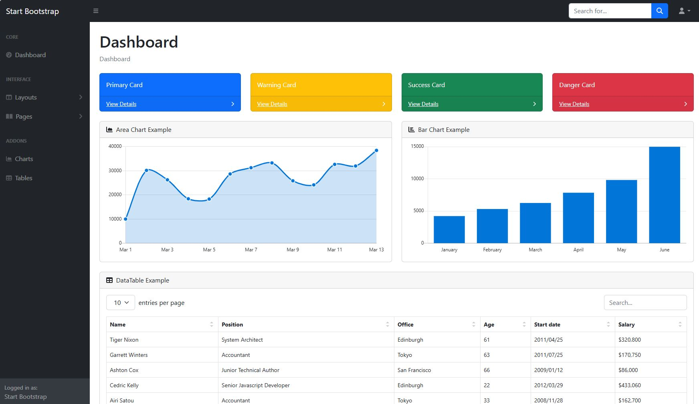
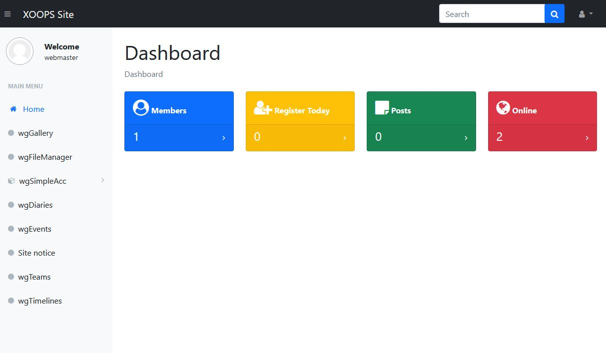
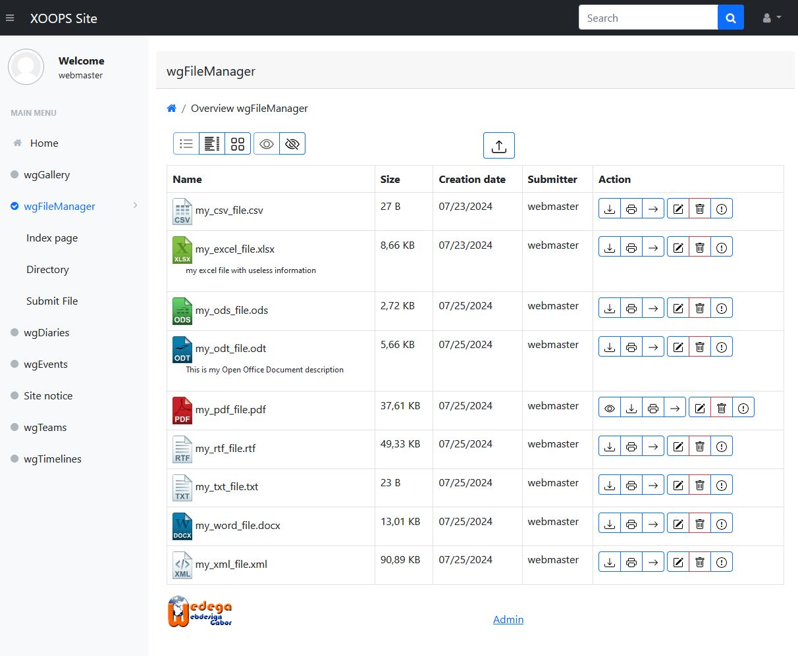
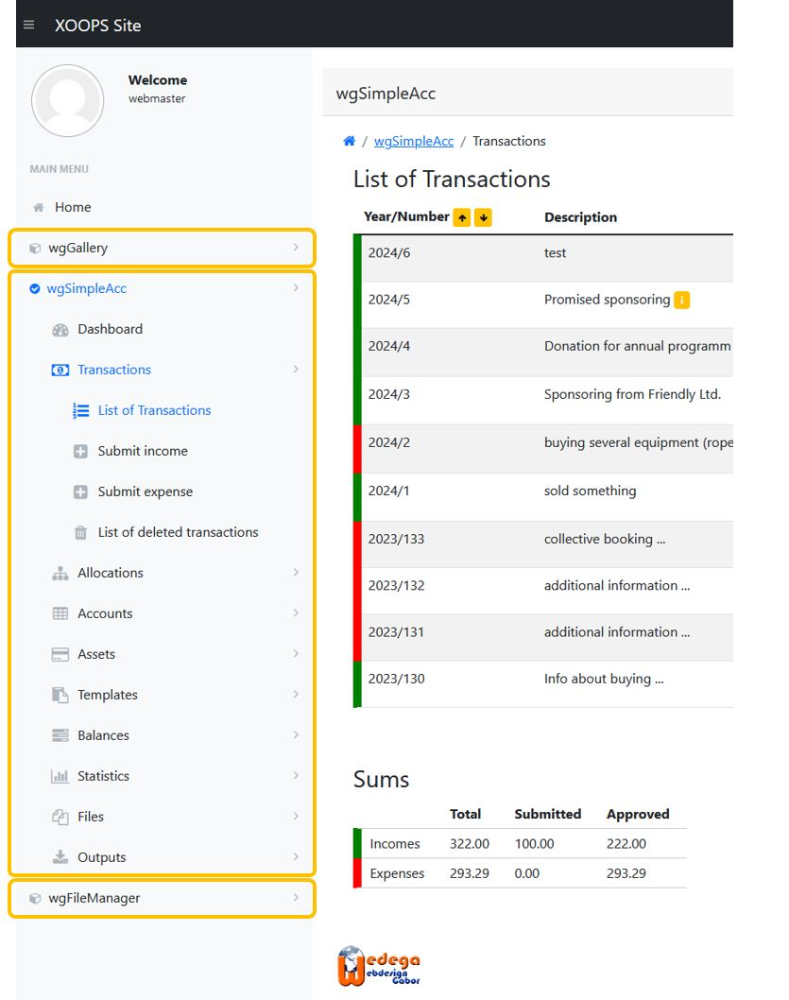
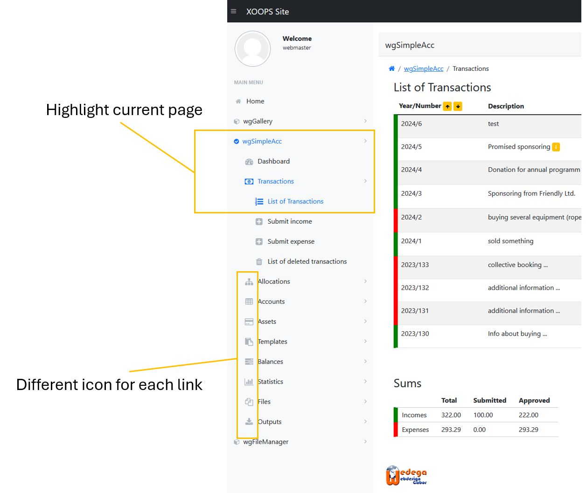

SBAdmin5 Bootstrap 5 template by [Start Bootstrap - SB Admin](https://startbootstrap.com/templates/sb-admin/) ported to work and powered with [XOOPS CMS](https://www.xoops.org/) as a frontend theme

# Features
A Bootstrap 5 XOOPS Theme with minimal custom styling. Suitable theme in building intranet, web apps and dashboards

- Closed Site Template (For Intranet Website)
- Support for XOOPS myMenus Module
- SCSS based theme with built in scripts for compiling Pug and CSS
- A flexbox based layout with fixed and static navigation options
- Toggleable sidebar menu with intuitive toggled states
- Custom panel styling
- Customizable main menu

# Preview
## Dark mode

## Light mode

# Installation

1. To download from GitHub, you should navigate to the top level of the project and then a green "Code" download button will be visible on the right. 
2. Choose the Download ZIP option from the Code pull-down menu. That ZIP file will contain the entire theme
3. Your download may have a folder inside a folder when you uncompress the files (eg: sbadmin5-main\sbadmin5-main)
4. Rename the subfolder sbadmin5-main to sbadmin5 and move it to your XOOPS themes folder www.yoursite.com/themes/
5. Go to System Admin->Preferences-> System Options -> General Settings, and make sbadmin5 as your Default Theme. 

# Customize Theme
1. Dark or light mode: adapt <{assign var=theme_mode value='light'}> to light or dark

# Customize Main Menu

## 1. Support for MyMenus Module

1.1. If you already installed the MyMenus Module, create a menu in Menus Manager
1.2. Add Link to your menu in Links Manager
1.3. In Links Manager, use the following 
	
	a. Alt Title -> Header 
	
	:: If you want to add a menu header else leave it empty 
	
	b. Menu Image - > fa fa-star
	
	::  You can use any of your favorite Font Awesome Icon. Leave it empty if you want to use the default defined icon

1.4. Activate the My menu Block 
1.5. In the block settings, use the following:

	a. Use skin from theme —> Yes
	
	b. Display Method —> Assign to template
	
	c. Unique ID —> sbadmin5
	
	d. The above is the recommended by My Menu module. After the settings, you can control the site menu using My Menu module.
	
	e. The Menu is displayed in the Left Block

1.6. If you do not have My Menus modules installed, the default navigation will be displayed.

## 2. Support for Modulemenu Class

The XOOPS main menu block supports only collapsable menu items for the active module and the XOOPS main menu supports only one level listing.

For non-active modules you have to click on module name first in order to see the sublinks of this module

In order to see the sublinks of multiple modules you can customize the main menu by using Modulemenu class

### How to create:

#### 2.1 Create a class/Modulemenu.php

#### 2.2. Add function 'getMenuitemsSbadmin5'

    public function getMenuitemsSbadmin5()
    {
        $items = [];

        return $items;
    }

#### 2.3. Add the code to create the list of sublinks. 

##### 2.3.1 In general you can goto xoops_version.php of the module and search for the $modversion['sub'] code

    $modversion['sub'][] = [
    'name' => \_MI_WGEVENTS_SMNAME1,
    'url'  => 'index.php',
    ];
    // Sub events
    $modversion['sub'][] = [
    'name' => \_MI_WGEVENTS_SMNAME2,
    'url'  => 'event.php',
    ];
    ...

##### 2.3.2 take this code

##### 2.3.3 copy it into function 'getMenuitemsSbadmin5' and replace

    $modversion['sub']
by
    $items

##### 2.3.4 use always full link, e.g. 

    'url'  => $urlModule . 'event.php',
instead of

    'url'  => 'event.php',

##### 2.3.5 finally it should looks like this

    public function getMenuitemsSbadmin5() {
        $moduleDirName = \basename(\dirname(__DIR__));
        $subcount      = 1;
        $pathname      = \XOOPS_ROOT_PATH . '/modules/' . $moduleDirName . '/';
        $urlModule     = \XOOPS_URL . '/modules/' . $moduleDirName . '/';
    
        require_once $pathname . 'include/common.php';
        $helper = \XoopsModules\Mymodulename\Helper::getInstance();
        
        //load necessary language files from this module
        $helper->loadLanguage('modinfo');
        
        // start creation of link list as array
        $items = [];
        $items[$subcount]['name']  = \_MI_MYMODULENAME_SMNAME1;
        $items[$subcount]['url'] =  $urlModule . 'index.php';
        
        $subcount++;
        $items[$subcount]['name']  = \_MI_MYMODULENAME_SMNAME2;
        $items[$subcount]['url'] =  $urlModule . 'index.php';
        
        $subcount++;
        $items[$subcount]['name']  = \_MI_MYMODULENAME_SMNAME3;
        $items[$subcount]['url'] =  $urlModule . 'index.php';
        // end creation of link list as array
        
        return $items;
    }

#### 2.4. In order to keep it simply you can adapt xoops_version.php as following

    // ------------------- Menu ------------------- //
    $currdirname  = isset($GLOBALS['xoopsModule']) && \is_object($GLOBALS['xoopsModule']) ? $GLOBALS['xoopsModule']->getVar('dirname') : 'system';
    if ($currdirname == $moduleDirName) {
        $submenu = new \XoopsModules\Mymodulename\Modulemenu;
        $menuItems = $submenu->getMenuitemsSbadmin5();
        foreach ($menuItems as $key => $menuItem) {
            $modversion['sub'][$key]['name'] = $menuItem['name'];
            $modversion['sub'][$key]['url'] = $menuItem['url'];
        }
    }

now all themes use the same code, but sbadmin5 theme can display collapsable sublink list

#### 2.5. Extra features
sbadmin5 main menu supports additional sublink parameters

    highlight: if true then this link will be highlighted
    icon: you can use a different icon for each link
    sublinks: you can use sublinks for nested menues; sbadmin5 supports currently 3 levels

Therefore it can looks like 

    $nav_items1[] = [

    'highlight' => strpos($requestUri, $moduleDirName . '/index.php') > 0,
    'url' => $urlModule . 'index.php',
    'icon' => '<i class="fa fa-tachometer fa-fw fa-lg"></i>',
    'name' => \_MA_WGSIMPLEACC_DASHBOARD,
    'sublinks' => []
    ];

#### 2.6. Examples

you can find various examples in directory sbadmin5/docs/Modulemenu :)